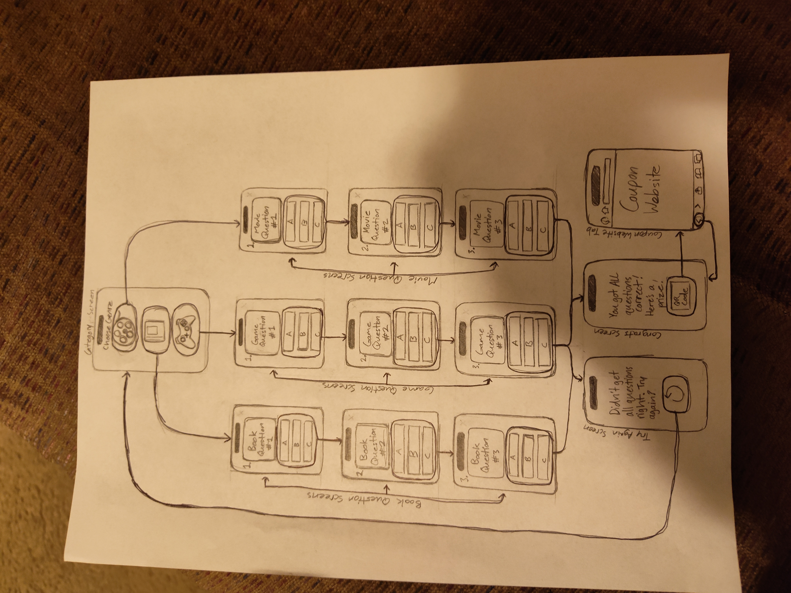

## Original App Design Project - README Template
## APP_NAME_HERE: Trivia of Pop
## Table of Contents
- Overview
- Product Spec
- Wireframes
- Schema
## Overview
- Description
This app tests user's pop culture knowledge by having you choose from the answer choices provided that answers the questions provided. Each pop culture question surrounds different entertainment mediums such as movies, games, and books.
# App Evaluation

- Category: Entertainment
- Mobile: You can take this quiz whereever you go because it doesn't need wifi. It might have audio, and it'll contain push buttons.
- Story: It's value is clear when it mentions great pieces of enteretainment that occured in the past that everyone loves, relying on nostalgia. Many people who are fans of pop culture can respond to playing this game because the game revolves around pop culture.
- Market: The user base will be possibly those who grew up on pop culture and have seen these books, movies, or games from the 80s to the 2000s. It can be about a hundred people playing this app. This app provides knowledge to a niche group of people who want to know about pop culture and what entertainment they haven't seen yet. The audience for this app can up to ages everyone ten and up, along with those who have seen these pop culture involvements.
- Habit: The average user will use it to test their knowledge on pop and to see if there any pop culture that they haven't experienced to see what can be their next movie or series to watch, book to read, or game to play. The average user will most likely consume the app rather than create it.
- Scope: The scope of this app might take a little longer than four weeks to make, since I'm dealing with impoertant schoolwork from all my courses. A stripped down version of this will still be interesting because at the end of the day I'm still learning how to make an app, not making a perfect app. It's basically supposed to be a simple trivia game for audience to enjoy and learn about different pieces of entertainment that people from the 80s to the 2000s have experienced. I'm not fully sure of what questions I'll ask, but it'll be surrounding movies, books, and games.

## Product Spec

1. User Stories (Required and Optional)

Required Must-have Stories
- Has three buttons representing categories to choose from.
- Each category has three questions for the user to answer.
- Each question has answer choices for them to pick.
- There is a prize at the end of the questions if the user answers all the questions right.
- A view controller showing how many questions I got right.
- A message showing the user must try again if they didn't answer all the answers correctly.
- User can tap restart button to restart the game.
- User can scan QR code for prize.

Optional Nice-to-have Stories
- A pause menu for the user to restart.
- A timer that has users answer questions quickly before time runs out.
- A screen that shows the person got a wrong answer each time they tapped the wrong answer.

2. Screen Archetypes
- Category screen:
-The user selects which entertainment category to choose from: Movies, Books, and Games.

- Movie Question Screens:
-The user chooses one of the answer choices that answers the question about movies(this repeats for two more screens after the first answer is chosen.)
- Book Question Screens:
-The user chooses one of the answer choices that answers the question about movies(this repeats for two more screens after the first answer is chosen.)
- Game Question Screens:
-The user chooses one of the answer choices that answers the question about movies(this repeats for two more screens after the first answer is chosen.)
- Try Again Screen:
-User must try again by tapping the restart button.
-Congrats Screen:
-User scans the QR code on the screen that takes them to a different tab.
- Coupon Tab:
-QR code takes you to a new tab where the user uses coupons for a special treat.

3. Navigation

Tab Navigation (Tab to Screen)

- Movie Icon
- Book Icon
- Game Icon

Flow Navigation (Screen to Screen)

- Congrats screen
  =>Coupon website
  
Wireframes

[BONUS] Digital Wireframes & Mockups
[BONUS] Interactive Prototype
Schema
[This section will be completed in Unit 9]

Models
[Add table of models]

Networking
[Add list of network requests by screen ]
[Create basic snippets for each Parse network request]
[OPTIONAL: List endpoints if using existing API such as Yelp]
